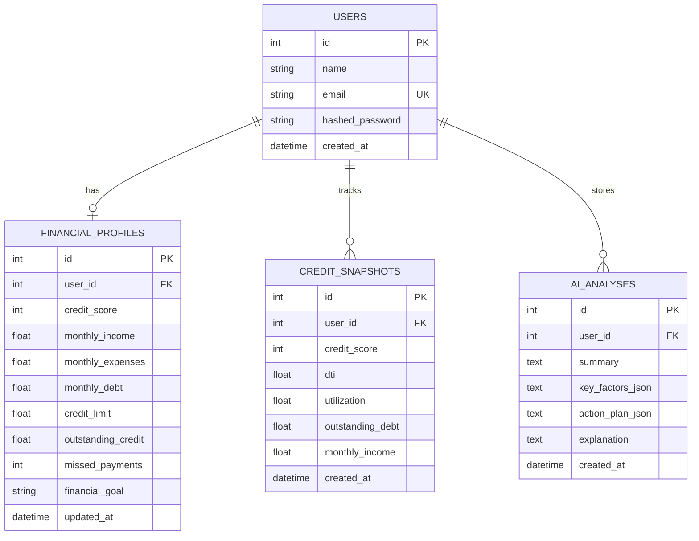

# CREDIT ASSISTANT 💳 AI-Powered Credit Health & Financial Guidance Platform

Credit Assistant is a full-stack educational financial platform designed for users navigating the Indian financial ecosystem. It enables users to input their credit score and financial metrics, automatically calculates key ratios such as **Debt-to-Income (DTI)** and **Credit Utilization**, visualizes credit score progress over time, identifies potential financial bottlenecks, and provides personalized educational recommendations using **Google Gemini AI**.

---

## 🌟 Key Features

1. **Modern Fintech Landing Page**: Clear CTAs, feature showcases, and educational disclaimers.
2. **User Authentication**: Secure Email/Password registration & login with bcrypt password hashing and JWT token authorization.
3. **Guided Financial Setup**: Interactive form to input credit score, credit card limits, outstanding balances, monthly income, expenses, debt/EMI payments, missed payment counts, and financial goals.
4. **Automated Backend Financial Formulas**:
   - **Debt-to-Income (DTI)** Ratio: `(Monthly Debt / Monthly Income) * 100`
   - **Credit Utilization**: `(Outstanding Card Balance / Credit Limit) * 100`
   - **Available Credit**: `Credit Limit - Outstanding Balance`
   - **Score & Ratio Deltas**: Compares current metrics against previous historical snapshots.
5. **Fintech Dashboard**:
   - 4 Metric Cards with contextual status badges and explanatory notes.
   - **Recharts Line Chart**: Displays database-backed historical credit score progress.
   - **Recharts Donut Chart**: Visualizes Used Credit vs Available Credit with exact ₹ values and percentages.
   - **Credit Health Bottleneck Insights**: Automatically flags high utilization, high DTI, missed payments, or declining score trends.
6. **Google Gemini AI Integration**:
   - **5-Step Educational Action Plan**: Generates structured summaries, key factors, 5 prioritized educational steps, and detailed explanations.
   - **"Ask Credit Assistant" Chat**: Interactive conversational Q&A widget with predefined question prompts.
7. **Progress Tracking**: Dedicated page with snapshot history tables, change delta cards (+/- points/percentages), and multi-metric timeline.
8. **One-Click Demo Mode**: Pre-loaded with demo user **Aarav Sharma** (Score: 650, DTI: 25%, Utilization: 60%, 3 historical snapshots).

---

## 🛠️ Technology Stack

- **Frontend**: React 18, Vite, TypeScript, Tailwind CSS, Recharts, Lucide React Icons.
- **Backend**: Python 3.14+, FastAPI, Pydantic v2, SQLAlchemy ORM.
- **Database**: SQLite (local development), PostgreSQL migration ready.
- **AI Engine**: Google Gemini API (`google-genai` SDK + intelligent fallback engine).
- **Authentication**: PyJWT + Passlib/bcrypt.

---

## 📁 Project Structure

```text
credit-assistant/
├── backend/
│   ├── app/
│   │   ├── api/             # FastAPI Routers (auth, profile, dashboard, progress, ai)
│   │   ├── core/            # Configuration & Security (JWT, bcrypt)
│   │   ├── database/        # Connection & SQLite initialization
│   │   ├── models/          # SQLAlchemy Models (User, Profile, Snapshot, AIAnalysis)
│   │   ├── schemas/         # Pydantic Schemas for validation
│   │   └── services/        # Formulas, Insights, Gemini AI & Demo Seeder
│   ├── main.py              # FastAPI server entry point
│   ├── requirements.txt
│   └── credit_assistant.db  # Local SQLite database
├── frontend/
│   ├── src/
│   │   ├── components/      # Reusable UI (Navbar, Footer, MetricCard, ScoreChart, etc.)
│   │   ├── pages/           # Landing, Login, Register, ProfileSetup, Dashboard, Progress, AIAdvisor
│   │   ├── context/         # AuthContext
│   │   ├── services/        # API client
│   │   └── types/           # TypeScript interfaces
│   ├── index.html
│   ├── package.json
│   └── vite.config.ts
├── .env.example             # Environment variable template
└── README.md
```

---

## 📊 Database Schema



---

## 🚀 Installation & How to Run

### Prerequisites
- Python 3.10+
- Node.js v18+ and npm

### 1. Backend Setup

```bash
cd backend

# Install Python packages
pip install fastapi uvicorn sqlalchemy pydantic pydantic-settings pyjwt bcrypt python-dotenv google-genai httpx email-validator

# Start the FastAPI server
python -m uvicorn main:app --host 127.0.0.1 --port 8000 --reload
```

The backend server will run on `http://127.0.0.1:8000`. API Swagger Docs available at `http://127.0.0.1:8000/docs`.

### 2. Frontend Setup

```bash
cd frontend

# Install dependencies
npm install

# Start Vite React dev server
npm run dev
```

The frontend application will open on `http://localhost:3000`.

---

## 🔑 Demo Credentials

To evaluate the application instantly without filling out a form, click **"Try Demo Mode"** on the landing or login page:
- **Email**: `aarav@example.com`
- **Password**: `demo123password`
- **Pre-Loaded Snapshots**: 3 historical entries (Score 620 → 635 → 650) displaying line trends, donut chart, and bottleneck insights.

---

## 🤖 Gemini API Integration

Set your API key in `.env`:
```env
GEMINI_API_KEY=your_gemini_api_key_here
```

If no key is configured or offline, Credit Assistant activates its built-in rule engine fallback to guarantee 100% functional demonstrations.

---

## 🛡️ Disclaimer

Credit Assistant provides educational information for self-monitoring purposes and does **NOT** calculate official CIBIL, Experian, or credit-bureau scores, nor does it provide regulated financial investment advice.
